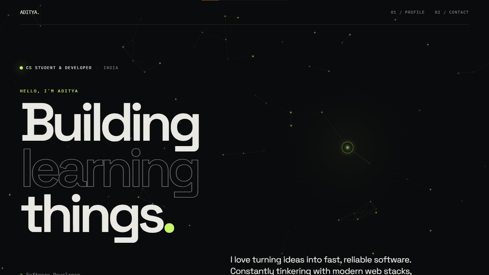
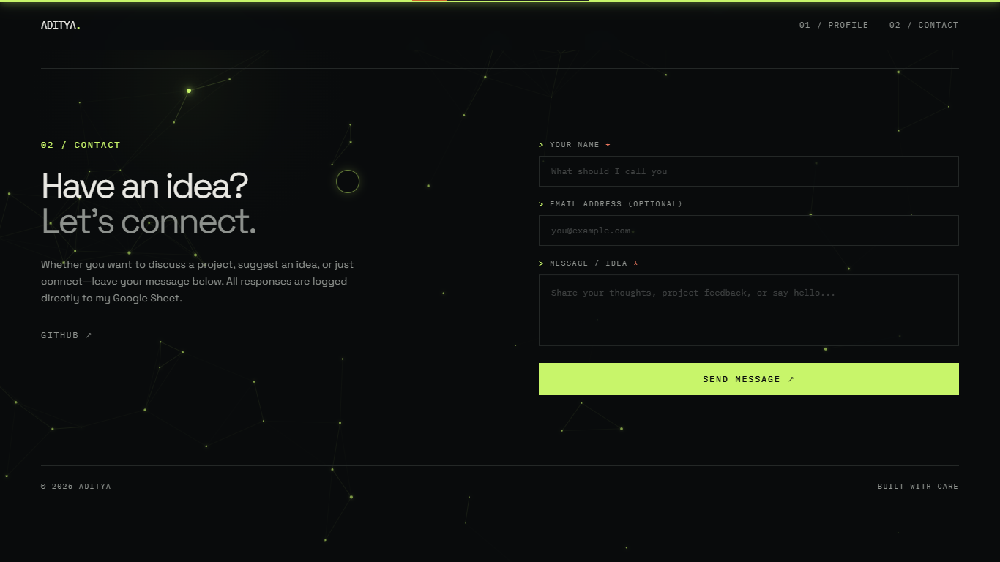
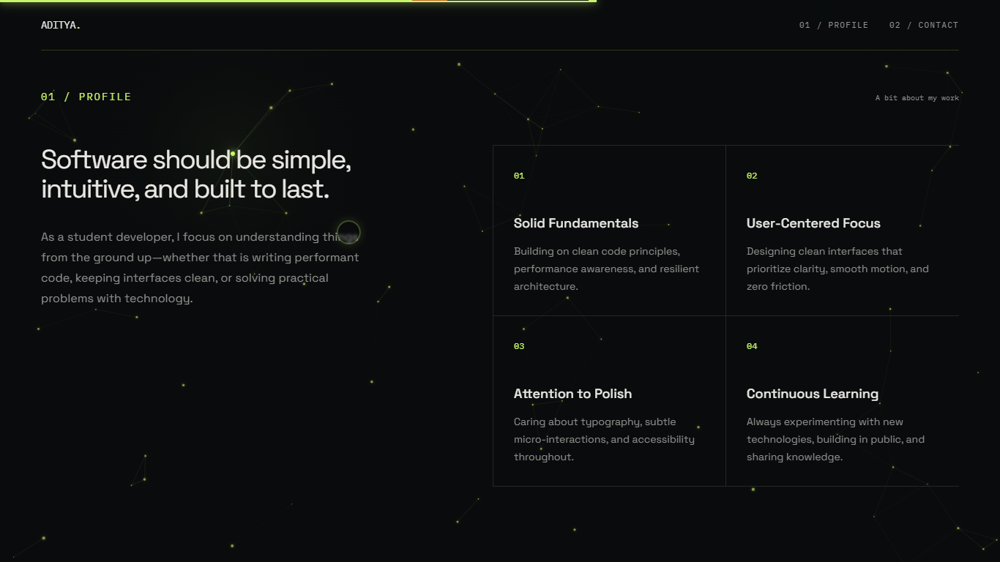

# Aditya / Software Developer

A personal portfolio website, built to introduce my work and give people a simple way to contact me.

****

## How I Made It

I built the site from scratch with HTML, CSS, and vanilla JavaScript:

**HTML** provides the portfolio layout, profile section, navigation, and contact form.
**Tailwind CSS** uses in the utility-based styling, layout, and color system.
**JavaScript** use in scroll progress, animated section, interactive profile grid, and the custom cursor.

## Quick Start

Just click on the link to go to my website**[OPEN THE LIVE PROFILE ->](https://adi-1001.vercel.app/)** That's it.

## Screenshots

****

****

****

## Feature

- A partical animation in the background.
- A custom mouse pionter which attach with particle
- Animation in scrolling
- A commentbox for contact and ideas
